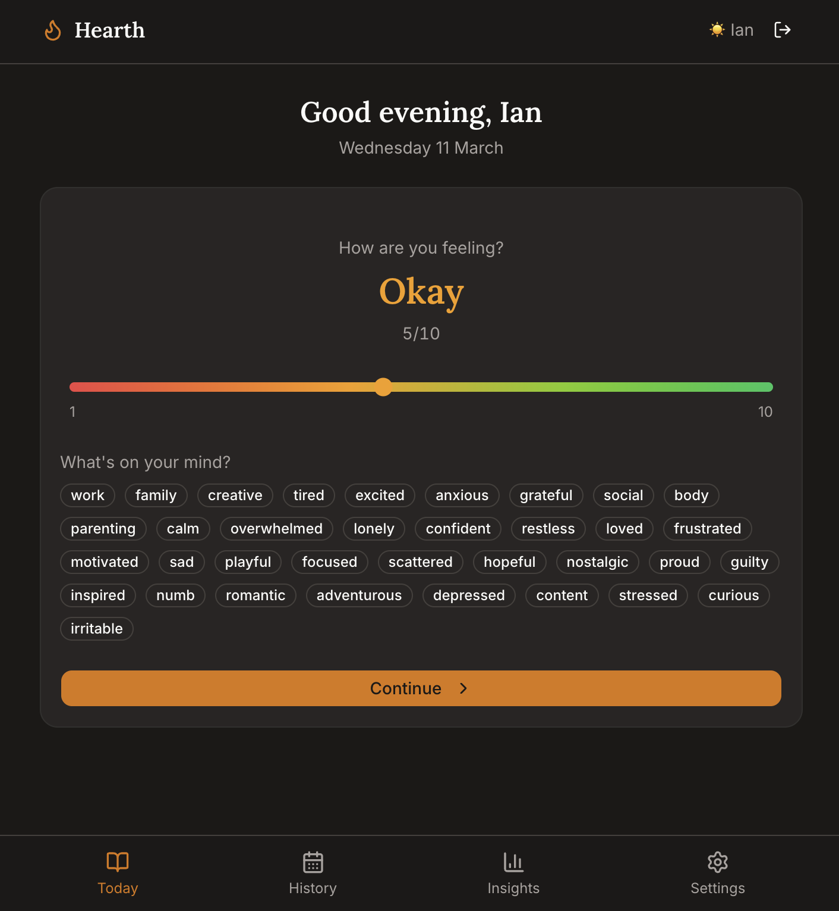
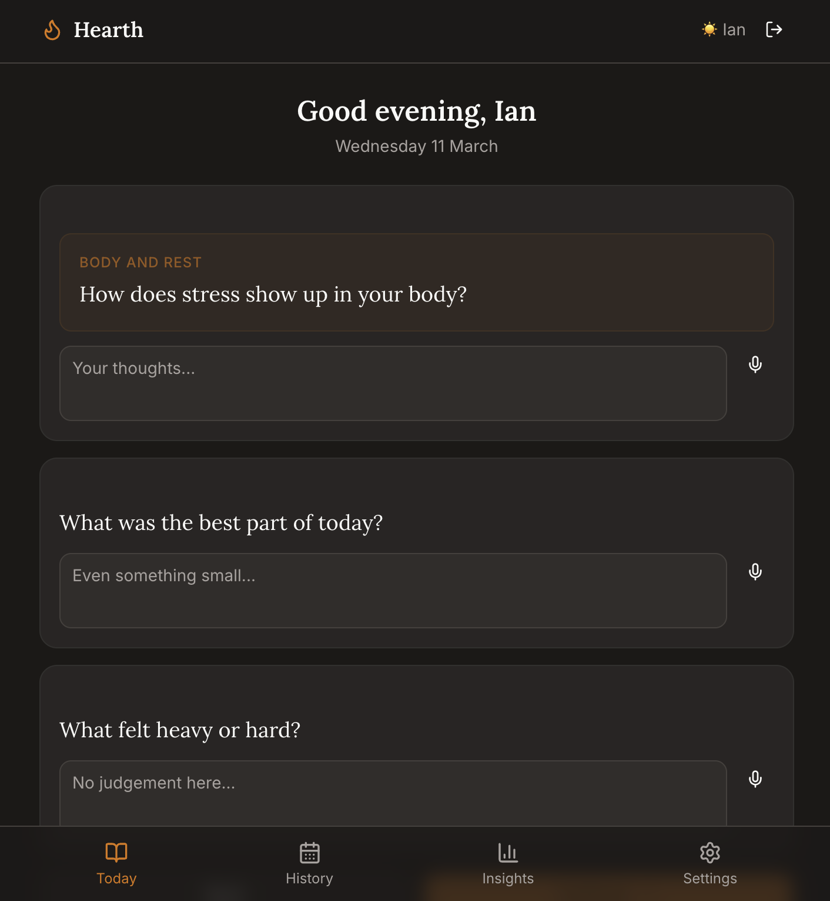
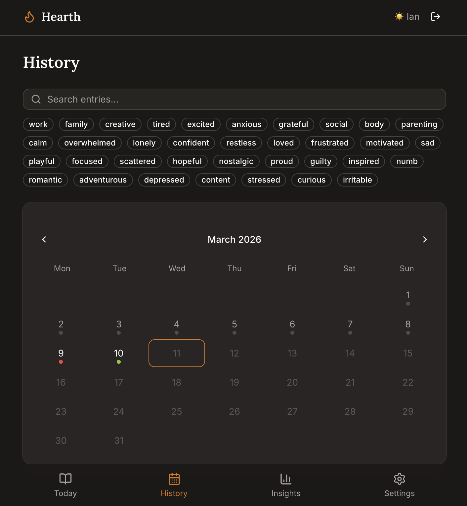

# Hearth

A private, self-hosted AI journaling app for couples or small households.
Built with Next.js 16, Supabase, and Claude.

**Core philosophy:** Two minutes. Three questions. No blank page. An AI that listens — not lectures.

## Screenshots

| Mood tracking | Guided entry | History |
|---|---|---|
|  |  |  |

## Features

- Daily mood tracking with visual slider (1-10, colour-coded)
- Three-question guided entry + free write
- 120+ rotating prompts — same prompt for all users each day (conversation starter)
- AI acknowledgment after each entry — warm, specific, never advice-giving
- Weekly AI-written pattern summaries
- Mood trend charts + streak tracking
- Voice-to-text input (Web Speech API)
- Opt-in evening browser reminders with one-tap journal access
- Calendar history view with full-text search
- Mood tag analytics (which tags correlate with high/low mood)
- Private by design — no analytics, no ads, no tracking

## Tech Stack

| Layer | Choice |
|---|---|
| Framework | Next.js 16 (App Router) |
| Database | Supabase (Postgres + Auth) |
| AI | Anthropic Claude API |
| Styling | Tailwind CSS + shadcn/ui |
| Charts | Recharts |
| Motion | Framer Motion |

## Getting Started

### Prerequisites

- Node.js 20+
- A [Supabase](https://supabase.com) project (free tier works)
- An [Anthropic API key](https://console.anthropic.com)

### Setup

1. Clone the repo:
   ```bash
   git clone https://github.com/your-username/hearth.git
   cd hearth
   npm install
   ```

2. Copy environment variables:
   ```bash
   cp .env.example .env.local
   ```

3. Fill in your `.env.local`:
   - `NEXT_PUBLIC_SUPABASE_URL` — from Supabase dashboard
   - `NEXT_PUBLIC_SUPABASE_ANON_KEY` — from Supabase dashboard
   - `SUPABASE_SERVICE_ROLE_KEY` — from Supabase dashboard (Settings > API)
   - `ANTHROPIC_API_KEY` — from Anthropic console
   - `ALLOWED_EMAILS` — comma-separated list of allowed email addresses
   - `VAPID_SUBJECT`, `VAPID_PUBLIC_KEY`, `VAPID_PRIVATE_KEY` — Web Push credentials
   - `CRON_SECRET` — a random string of at least 32 characters for cron job auth

   Generate the VAPID keys once and keep the private key secret:
   ```bash
   npm run notifications:generate-keys
   ```

4. Apply all database migrations and sync the private allowlist:
   ```bash
   npx supabase link --project-ref YOUR_PROJECT_REF
   npx supabase db push
   npm run security:sync-allowlist
   ```

5. Start the dev server:
   ```bash
   npm run dev
   ```

6. Visit `http://localhost:3000` and log in with a magic link.

### Browser Reminders

The Settings page can enable notifications independently on each device and
send a real end-to-end test notification. Desktop browsers can test from
localhost; phones need the deployed HTTPS app.

On iPhone or iPad, tap **Share > Add to Home Screen**, launch Hearth from its
new icon, log in, then open **Settings > Evening reminder**. Tap **Turn on for
this device**, allow notifications, and use **Send test notification**.

The test button works without a scheduler. For automatic evening delivery,
apply migration `010_web_push_reminders.sql`, enable Supabase Cron, `pg_net`,
and Vault, then store the deployed Hearth URL and the same `CRON_SECRET` used
by the app:

```sql
select vault.create_secret(
  'https://your-hearth-domain.example',
  'hearth_app_url'
);

select vault.create_secret(
  'YOUR_RANDOM_CRON_SECRET_OF_AT_LEAST_32_CHARACTERS',
  'hearth_cron_secret'
);

select cron.schedule(
  'hearth-evening-reminders',
  '* * * * *',
  $$
  select net.http_get(
    url := (
      select rtrim(decrypted_secret, '/')
      from vault.decrypted_secrets
      where name = 'hearth_app_url'
    ) || '/api/cron/evening-reminders',
    headers := jsonb_build_object(
      'Authorization', 'Bearer ' || (
        select decrypted_secret
        from vault.decrypted_secrets
        where name = 'hearth_cron_secret'
      )
    ),
    timeout_milliseconds := 10000
  ) as request_id;
  $$
);
```

The job runs every minute, respects each profile's timezone, skips users who
already journaled that day, retries transient delivery failures, and prevents
duplicate scheduled attempts per active subscription and local date. Keep
notification text generic because it may appear on a lock screen.

### Restricting Access

Set `ALLOWED_EMAILS` in your environment to restrict access:
```
ALLOWED_EMAILS=alice@example.com,bob@example.com
```

After changing the list, run `npm run security:sync-allowlist`. Access is
enforced both by the application and by Supabase row-level security. Unknown
addresses are rejected by the database even if someone bypasses the web app.

## Deploying to Vercel

1. Push to GitHub
2. Import project in [Vercel](https://vercel.com)
3. Add all environment variables from `.env.example`
4. Deploy

The weekly summary cron job runs automatically on Sundays at 7:00 AM UTC (configured in `vercel.json`).

## Self-Hosting with Docker

```bash
docker compose up -d
```

Note: You'll still need a Supabase instance (cloud or [self-hosted](https://supabase.com/docs/guides/self-hosting)).

## Project Structure

```
app/
  (auth)/login/     — Magic link login
  (app)/            — Main app shell
    page.tsx        — Today's entry
    history/        — Calendar + search
    insights/       — Mood charts + AI summary
    settings/       — Profile settings
  api/
    entries/        — CRUD for journal entries
    ai/summary/     — Weekly AI summary generation
    cron/           — Cron job endpoints
components/
  journal/          — Entry form, mood slider, voice input
  insights/         — Charts, history, summary
lib/
  supabase/         — Supabase client/server/middleware
  claude.ts         — Anthropic API wrapper
  prompts.ts        — 120+ rotating prompts
```

## Contributing

PRs welcome. This was built for a family of two but designed for anyone.

## License

MIT
