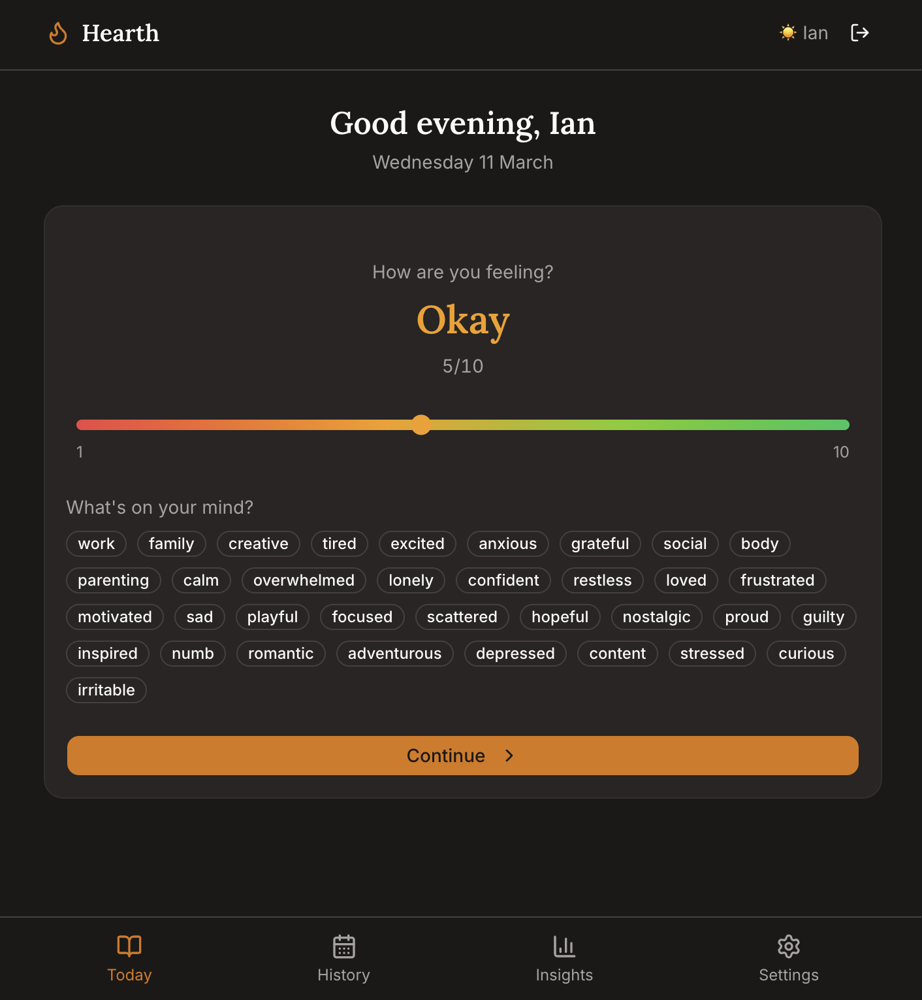
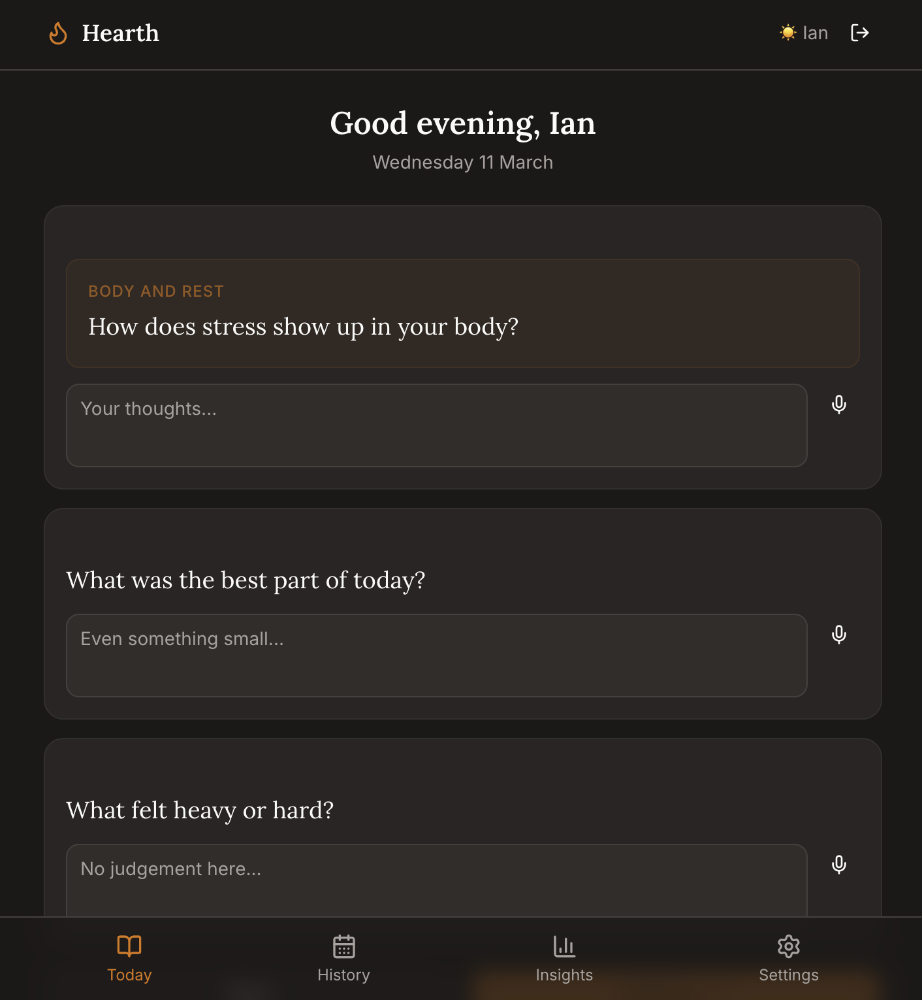
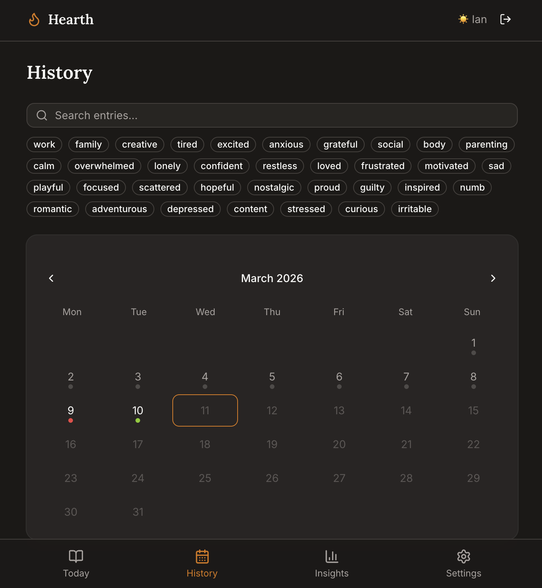

# Hearth

A private, self-hosted AI journaling app for couples or small households.
Built with Next.js 16, Supabase, and OpenAI.

**Core philosophy:** Two minutes. Three questions. No blank page. An AI that listens — not lectures.

## Screenshots

| Mood tracking | Guided entry | History |
|---|---|---|
|  |  |  |

## Features

- Daily mood tracking with visual slider (1-10, colour-coded)
- Three-question guided entry + free write
- 120+ rotating prompts — same prompt for all users each day (conversation starter)
- AI acknowledgment after each entry — warm, specific, never advice-giving
- Weekly AI-written pattern summaries
- Mood trend charts + streak tracking
- Voice-to-text input (Web Speech API)
- Opt-in evening browser reminders with one-tap journal access
- Calendar history view with full-text search
- Mood tag analytics (which tags correlate with high/low mood)
- Private by design — no analytics, no ads, no tracking

## Tech Stack

| Layer | Choice |
|---|---|
| Framework | Next.js 16 (App Router) |
| Database | Supabase (Postgres + Auth) |
| AI | OpenAI Responses API |
| Styling | Tailwind CSS + shadcn/ui |
| Charts | Recharts |
| Motion | Framer Motion |

## Getting Started

### Prerequisites

- Node.js 24+
- A [Supabase](https://supabase.com) project (free tier works)
- An [OpenAI API key](https://platform.openai.com/api-keys)

### Setup

1. Clone the repo:
   ```bash
   git clone https://github.com/your-username/hearth.git
   cd hearth
   npm install
   ```

2. Copy environment variables:
   ```bash
   cp .env.example .env.local
   ```

3. Fill in your `.env.local`:
   - `NEXT_PUBLIC_SUPABASE_URL` — from Supabase dashboard
   - `NEXT_PUBLIC_SUPABASE_ANON_KEY` — from Supabase dashboard
   - `SUPABASE_SERVICE_ROLE_KEY` — from Supabase dashboard (Settings > API)
   - `OPENAI_API_KEY` — from the OpenAI API dashboard
   - `ALLOWED_EMAILS` — comma-separated list of allowed email addresses
   - `VAPID_SUBJECT`, `VAPID_PUBLIC_KEY`, `VAPID_PRIVATE_KEY` — Web Push credentials
   - `CRON_SECRET` — a random string of at least 32 characters for cron job auth

   Generate the VAPID keys once and keep the private key secret:
   ```bash
   npm run notifications:generate-keys
   ```

4. Apply all database migrations, sync the private allowlist, and provision
   each approved Auth identity:
   ```bash
   npx supabase link --project-ref YOUR_PROJECT_REF
   npx supabase db push
   npm run security:sync-allowlist
   npm run security:provision-user -- person@example.com
   ```

5. Start the dev server:
   ```bash
   npm run dev
   ```

6. Visit `http://localhost:3000` and log in with a magic link.

### AI Privacy

AI processing is enabled for every Hearth account. Hearth sends the journal
text and display name needed for acknowledgments and summaries to the OpenAI
API. Daily acknowledgments use GPT-5.6 Luna, weekly and monthly insights use
GPT-5.6 Terra, and therapist/export reports use GPT-5.6 Sol by default.
Hearth sets `store: false` so Responses application state is not retained for
later retrieval. OpenAI may still retain API content in abuse-monitoring logs
for up to 30 days unless stricter project data controls are enabled. The
internal `ai_enabled` flag remains available to administrators as an emergency
kill switch, but it is not a user-facing preference.

### Journal history in AI reports

New weekly and monthly reflections (including scheduled ones) and therapist/support
exports review all of the signed-in person's saved journal entries. The selected
week, month, or export dates remain the focus; entries outside that period supply
explicitly dated context. Reports include mood scores, labels and tags, prompt
questions and answers, highlights, challenges, gratitude, and free writing.
Unsaved drafts and previous AI-generated text are excluded.

History is paginated so the database row limit does not silently omit older entries.
Small histories are supplied verbatim; large histories are reviewed in sections
and combined into evidence notes before the final report. This reviews every
section but is a lossy synthesis, not a guarantee that every detail appears in the
final report. Incomplete AI responses or history-fetch failures fail generation
rather than saving a partial report. Large histories can require additional time
and AI requests. Existing saved reflections remain until refreshed using
**Refresh with full journal history**.

### Partner connections

Open **Partner** to invite an existing, allowlisted Hearth account by email.
Invitations expire after seven days. The recipient accepts or declines in Hearth;
each account can have one accepted partner. No connections are created for existing
users automatically, and invitations do not provision accounts or change the allowlist.

After acceptance, either person can choose a saved entry, draft a broad emotional
summary using AI (or write their own), edit it, and explicitly share one sentence
of at most 15 words. Only that approved sentence and its date are visible to the
partner, including on Today. The latest shared glimpse replaces the previous one.
Private entries, mood scores, unsaved drafts, reflections, and exports remain private.
Withdrawal and disconnection revoke access; edited or deleted source entries remove
outdated glimpses. Reconnecting does not restore earlier shares.

Apply `018_partner_connections.sql` before using this feature. It creates restricted
connection/glimpse tables and authenticated RPCs without broadening journal RLS.
For invitation emails, configure `RESEND_API_KEY`, `HEARTH_EMAIL_FROM` (a verified
sender), and `HEARTH_APP_URL` (the HTTPS app URL). Existing Resend credentials can be
reused. If email is unavailable, invitations still appear in the recipient's Partner
screen, and the sender is told that email could not be sent. AI drafting uses the
existing OpenAI configuration; manual sharing works without an AI key.

Run `npm test` for API/privacy validation tests and `npm run test:partner-db` for
connection lifecycle and access tests in an isolated, disposable PostgreSQL Docker
container. These tests do not contact the production database, AI provider, or email
recipients.

### Browser Reminders

The Settings page can enable notifications independently on each device and
send a real end-to-end test notification. Desktop browsers can test from
localhost; phones need the deployed HTTPS app.

On iPhone or iPad, tap **Share > Add to Home Screen**, launch Hearth from its
new icon, log in, then open **Settings > Evening reminder**. Tap **Turn on for
this device**, allow notifications, and use **Send test notification**.

The test button works without a scheduler. For automatic evening delivery,
apply migration `010_web_push_reminders.sql`, enable Supabase Cron, `pg_net`,
and Vault, then store the deployed Hearth URL and the same `CRON_SECRET` used
by the app:

```sql
select vault.create_secret(
  'https://your-hearth-domain.example',
  'hearth_app_url'
);

select vault.create_secret(
  'YOUR_RANDOM_CRON_SECRET_OF_AT_LEAST_32_CHARACTERS',
  'hearth_cron_secret'
);

select cron.schedule(
  'hearth-evening-reminders',
  '* * * * *',
  $$
  select net.http_get(
    url := (
      select rtrim(decrypted_secret, '/')
      from vault.decrypted_secrets
      where name = 'hearth_app_url'
    ) || '/api/cron/evening-reminders',
    headers := jsonb_build_object(
      'Authorization', 'Bearer ' || (
        select decrypted_secret
        from vault.decrypted_secrets
        where name = 'hearth_cron_secret'
      )
    ),
    timeout_milliseconds := 10000
  ) as request_id;
  $$
);
```

The job runs every minute, respects each profile's timezone, skips users who
already journaled that day, retries transient delivery failures, and prevents
duplicate scheduled attempts per active subscription and local date. Keep
notification text generic because it may appear on a lock screen.

### Restricting Access

Set `ALLOWED_EMAILS` in your environment to restrict access:
```
ALLOWED_EMAILS=alice@example.com,bob@example.com
```

After changing the list, run `npm run security:sync-allowlist`, then run
`npm run security:provision-user -- person@example.com` for each new address.
Hearth does not create accounts from the public login form. Access is enforced
both by the application and by Supabase row-level security; the login response
also stays generic so it does not reveal which addresses have accounts.

## Deploying to Vercel

1. Push to GitHub
2. Import project in [Vercel](https://vercel.com)
3. Add all environment variables from `.env.example`
4. Deploy

The weekly summary cron job runs automatically on Sundays at 7:00 AM UTC (configured in `vercel.json`).

## Self-Hosting with Docker

```bash
docker compose up -d
```

Note: You'll still need a Supabase instance (cloud or [self-hosted](https://supabase.com/docs/guides/self-hosting)).

## Project Structure

```
app/
  (auth)/login/     — Magic link login
  (app)/            — Main app shell
    page.tsx        — Today's entry
    history/        — Calendar + search
    insights/       — Mood charts + AI summary
    settings/       — Profile settings
  api/
    entries/        — CRUD for journal entries
    ai/summary/     — Weekly AI summary generation
    cron/           — Cron job endpoints
components/
  journal/          — Entry form, mood slider, voice input
  insights/         — Charts, history, summary
lib/
  supabase/         — Supabase client/server/middleware
  openai.ts         — OpenAI Responses API wrapper
  prompts.ts        — 120+ rotating prompts
```

## Contributing

PRs welcome. This was built for a family of two but designed for anyone.

## License

MIT
